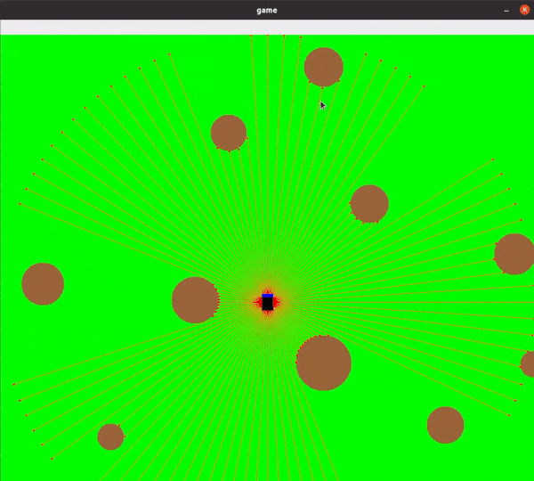

# python_drone_game_laser_scan
  
Python-based 2d simulator of drone with lidar.   

There are files included for training Reainforcement Learning Agent with stable-baselines3 library.  
  
Drone controlled by PPO Agent:

